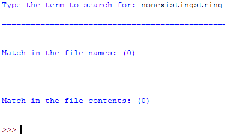
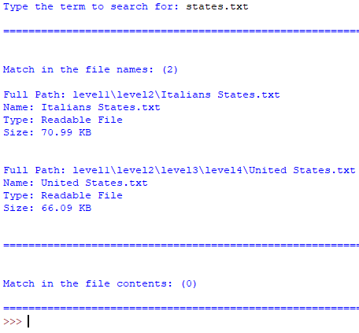
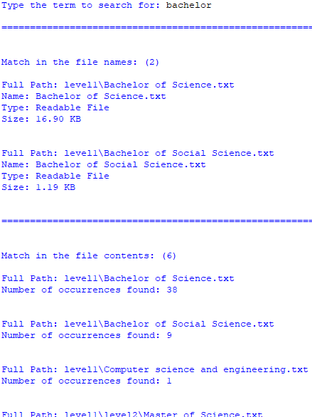
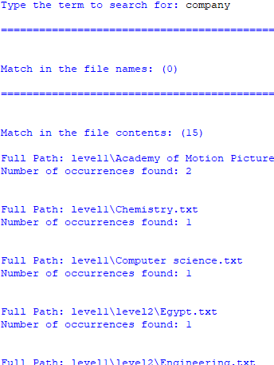

# DCR-B-Project

Educational project, for the Digital Content Retrieval Course, to build a search facility on a subtree of a local file system.

- The schema of the database, in SQL ddl [» schemaDDL.sql «](schemaDDL.sql)
- The developed code for loading the database [» script_build.py «](script_build.py)
- The developed code for the search engine [» script_search.py «](script_search.py)
- A listing of the whole DCRB directory and sub-directories [» directories_list.txt «](directories_list.txt)
- A snapshot of the search for a “non existing” string
- 
- A snapshot of the search for a string matching at least two file names, but not found in any searchable file
- 
- A snapshot of the search for a string matching at least one file name and contained in at least one searchable file, with the counts of the occurrencies in the file(s)
- 
- A snapshot of the search for a string that does not match a file name but is found in at least one searchable file, with the counts of the occurrencies in the file(s)
- 
